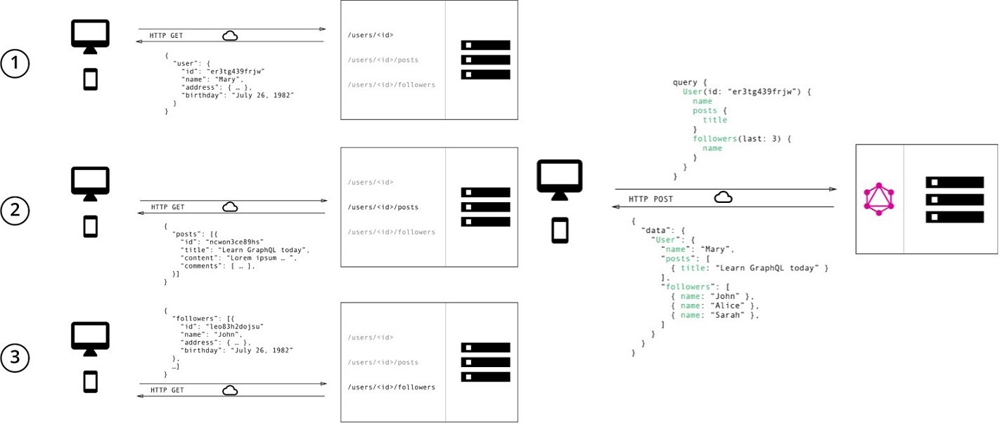

# さくっとNuxt.jsとApolloでGraphQLの雰囲気を掴む

---

# 目次
- GraphQLとは？
- Nuxt.js+Apolloでポケモン図鑑を作ってみた
- 結び

---

# GraphQLとは？
- API向けのクエリ言語
- 専用のサーバを立てることでクライアントとサーバー間のミドルウェアとして機能する
- request時に必要なdataを指定することでフロントエンドでの開発が行いやすくなる!?

> GraphQL 入門ガイド:https://circleci.com/ja/blog/introduction-to-graphql/

---

 
 

[InterSystemsデータプラットフォームのGraphQL
](https://jp.community.intersystems.com/post/intersystems%E3%83%87%E3%83%BC%E3%82%BF%E3%83%97%E3%83%A9%E3%83%83%E3%83%88%E3%83%95%E3%82%A9%E3%83%BC%E3%83%A0%E3%81%AEgraphql)

---

<h1 class="text-center">なんとなくすごそう</h1>

---

<h1 class="text-center">なんとなくすごそう</h1>

<h1 class="text-center">だがいまいちピンとこない</h1>

---

<h1 class="text-center">なんとなくすごそう</h1>

<h1 class="text-center">だがいまいちピンとこない</h1>

<h1 class="text-center">何か作ってみよう</h1>

---

[ポケモン図鑑](https://nuxt-graphql-demo.netlify.app/)

---

[https://github.com/lucasbento/graphql-pokemon](https://github.com/lucasbento/graphql-pokemon)

---

[実装解説](https://zenn.dev/kimkiyong/articles/b92b1029093741)

---
# 結び
- 実装することでなんとなく理解することができた
- 確かにクエリで欲しいデータのみ取得することでフロント部分の実装は楽になりそう
- typescriptの型と相性がよさそう
- graphQLサーバの開発が大変そう...(フロント+FFB+バックエンド)
